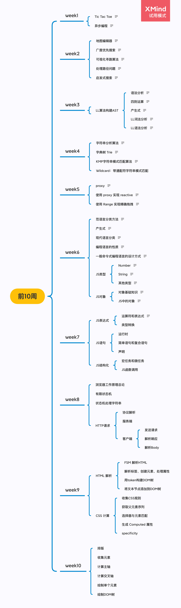

# 前十周总结

## 总览



## Week1

### 1.1 Tic Tac Toe

- 使用二位数组来表示棋盘
- inline-block 垂直对齐默认为 baseline，设置 vertical-align: middle，来是的元素排列整齐
- 使用满足交换律的运算来实现两个状态的翻转
- 深拷贝：JSON序列化和反序列化
- 利用同余特性将二维数组换成一维数组，方便进行数组拷贝，可以使用 Object.create(pattern)来实现数组克隆

### 1.2 异步编程

- callback：Js 没有同步等待方式，需要通过回调的方式实现异步
- Promise: 来自 Promise/A+ 跨语言的异步编程范式
- async/await：基于 Promise 的语法糖
- sleep 改成 happen (返回 promise, 在点击事件中 resolve)，实现手动切换红绿灯
- generator(函数返回一个迭代器): 使用 yield 模拟 async/await 
- async generator: 

``` js
async function* counter() {
  let i = 0
  while(true) {
    await sleep(1000)
    yield i++
  }
}

(async function () {
  for await (let v of counter()) {
    console.log(v)
  }
})()
```

## Week2

### 2.1 地图编辑器

- 寻路算法：广度优先算法
- mousedown 事件：e.which 判断鼠标按钮
- contextmenu:  禁用右键菜单弹出

### 2.2 广度优先搜索

- 采用递归的方式都是深度优先搜索；
- 寻路问题适合采用广度优先算法；
- JS 数组队列实现： push+shift 或 unshift+pop；
- 找到附近可以移动的点，push到队列中；
- 使用队列实现广度优先搜索；
- 使用栈实现深度优先搜索；
- A* 搜索只需将数据结构改成排序的结构；

### 2.3 可视化寻路算法

- insert 函数改成异步函数；
- 每插入一个点，等待一段时间，同时将修改DOM颜色背景，把寻路的过程以动画形式可视化出来

### 2.4 处理路径问题

- 克隆地图保存到 table 中
- 每插入一个点的同时保存前驱点
- 在找到终点后，从终点开始通过事先保存的 table 回溯前驱点得到路径

### 2.5 启发式搜索

- 启发式搜索：判断点的优先级，沿着优先级高的方向寻找路径
- A：不一定能找到最优路径的启发式搜索
- A*：能找到最优路径的启发式搜索
- 将queue换成一个排序的数据结构 Sorted
- Sorted的 give 方法使用 push 直接插入数据
- Sorted的 take 方法每次得到所有点中与终点最近的值
- take 方法中 pop 出最小值技巧：将最小值与最后一个值互换顺序，然后执行数组 pop 方法，这样可以将原本使用 splice 方法 O(N)操作降到O(1)
- 使用二叉堆替换 Sorted 数据结构，得到性能更优的启发式搜索

## Week3

LL算法构建AST

### 3.1 语法分析

- 词法分析：将编程语言字符串分词；
- 语法分析：将分词构成层层嵌套的抽象语法树（AST）；
- 解析语法树，生成目标代码并执行；
- 最著名的语法分析算法：LL算法和LR算法；
- LL算法：从左到右扫描，从左到右归约；

### 3.2 四则运算

- TokenNumber：0-9
- Operator: + - * /
- Whitespace: <SP>
- LineTerminator: <LF><CR>

### 3.3 产生式

```
<Expression>::=<AdditiveExpression><EOF>
<AdditiveExpression>::=<MultiplicativeExpression>|<AdditiveExpression><+><MultiplicativeExpression>|<AdditiveExpression><-><MultiplicativeExpression>
<MultiplicativeExpression>::=<Number>|<MultiplicativeExpression><*><Number>|<MultiplicativeExpression></><Number>
```

### 3.4 LL词法分析

- 用正则表达式做词法分析；
- dictionary 数组按照正则子表达式顺序保存对应终结符(token)类型；
- 使用 exec 和 lastIndex 来逐一提取token，当前后两次 lastIndex 之差大于匹配结果的完整长度时，说明最近匹配的子字符串含有未识别的字符串；
- 使用 generator 函数来，在while(true)循环体中 yield 出识别出来的 token;

### 3.5 LL语法分析

- LL语法分析的基本机构：每一个产生式对应一个函数；
- 从离终结符最近的产生式开始编写；
- 根据产生式编写顺序，编写逻辑支，通过 shift 和 unshift 方法从左向右规约生成语法树；

## Week4

### 4.1 字符串分析算法

字符串分析算法从简单到复杂：
- 字典树：大量高重复字符串的存储与分析，完全匹配
- KMP：在长字符串里找模式，部分匹配，三个计算机专家名字缩写
- Wildcard: 带通配符的字符串模式，可以理解为较弱的正则
- 正则: 字符串通用模式匹配，与有限状态机等价
- 状态机：通用字符串分析，比正则更强大
- LL LR：字符串多层级结构分析，LR理论比较复杂，比LL更强大，HTML 语法分析的 stack 就是LR的简化版，相当于LR(0)

### 4.2 字典树 Trie

- insert 方法：将字符串插入字典树
- most 方法：返回字典树中出现频率最多的字符串和次数
- 使用 Symbol('$') 作为属性，保对应字符的出现的次数，并每次插入节点时累加计数
- 字典树是Hash树应用的特例，Hash树最经典的应用也是字典树

### 4.3 KMP字符串模式匹配算法

- 遍历 pattern 字符串计算跳转表格：
- 遍历 source 字符串进行匹配；

### 4.4 Wildcard：带通配符字符串模式匹配

## Week5

### 5.1 Proxy

- 主要为底层库设计的
- 会降低代码的可预期性，不推荐在业务代码中大量使用

### 5.2 使用 proxy 实现 reactive

- 将创建 Proxy 包装函数 reactive 中；
- 使用全局 Map 缓存已经创建过 Proxy 的对象；
- callback 存储响应式对象属性回调；

### 5.3 使用 Range 实现精确拖拽(文字间)

- 在 document 上绑定鼠标事件：mousedown, mouseup, mousemove
- mousedown 事件处理中绑定 mousemove, mouseup
- mouseup 事件处理中移除 mousemove 和 mouseup
- 使用 dragable.style.transform 改变元素位置，实现拖动效果
- 使用 document.createRange，建一张 range 表，将所有可以插入的文本间隙
- CSSDOM API: range.getBoundingRect()

## Week6

### 6.1 范语言分类方法

- 非形式化语言：中文、英文
- 形式化语言（乔姆斯基谱系）
  - 0型 无限制文法
  - 1型 上下文相关文法
  - 2型 上下文无关文法
  - 3型 正则文法

### 6.2 产生式

- 用尖括号扩起来的名称表示语法结构名
- 语法结构分为基础结构和复合结构
  - 基础结构称终结符
  - 复合结构称非终结符
- 引号和中间的字符表示终结符
- 可以有括号
- * 表示重复多次
- | 表示或
- + 表示至少一次


- 0型 无限制文法
  - ?::=?
- 1型 上下文相关文法
  - ?<A>?::=?<B>?
- 2型 上下文无关文法
  - <A>::=?
- 3型 正则文法
  - <A>::=<A>? ✅
  - <A>::=?<A>? ❌

Javascript 整体是上下文无关文法，表达式主要是正则文法，部分特性如 `get` 和 `**` 运算属于上下文相关文法。

### 6.3 现代语言的分类

按形式语言用途:
- 数据描述语言
  - JSON
  - HTML
  - XAML
  - SQL
  - CSS
- 编程语言
  - C/C++
  - Java
  - C#
  - Python
  - Ruby
  - Perl
  - Javascript
  - Lisp
  - Clojure
  - Haskell

按形式语言表达方式:
- 声明式语言
  - JSON
  - HTML
  - XAML
  - SQL
  - CSS
  - Lisp
  - Clojure
  - Haskell
- 命令型语言
  - C/C++
  - Java
  - C#
  - Python
  - Ruby
  - Perl
  - Javascript

### 6.4 编程语言的性质

图灵完备性:
- 命令式——图灵机
  - goto
  - if 和 while
- 声明式——lambda
  递归

动态和静态:
- 动态
  - 在用户的设备/在线服务器上
  - 产品实际运行时
  - Runtime
- 静态
  - 在程序员的设备上
  - 产品开发时
  - Compiletime

### 6.5 一般命令式编程语言的设计方式

- Atom
  - Identifier
  - Literal
- Expression
  - Atom
  - Operator
  - Punctuator
- Statement
  - Expression
  - Keyword
  - Punctuator
- Structure
  - Function
  - Class
  - Process
  - Namespace
- Program
  - Program
  - Module
  - Package
  - Library

### 6.6 JS 类型

Atom：
- Grammar
  - Literal
  - Variable
  - Keywords
  - Whitespace
  - Line Terminator
- Runtime
  - Types
    - Number
    - String
    - Boolean
    - Object
    - Null
    - Undefined
    - Symbol
  - Execution Context

#### 6.6.1 Number

Number
- IEEE 754 Double Float
  - Sign (1)
  - Exponent (11)
  - Fraction (52)
- Grammar
  - DecimalLiteral
    - 0
    - 0.
    - .2
    - 1e3
    - 0.5 .toString(2)
  - BinaryIntegerLiteral
    - 0b111
  - OctalIntegerLiteral
    - 0o10
  - HexIntegerLiteral
    - 0xFF

#### 6.6.2 String

- Character
- Code Point
- Encoding
- ASCII (0~127)
- Unicode
- UCS
- GB
  - GB2312
  - GBK(GB13000)
  - GB18030
- ISO-8859
- BIG5

#### 6.6.3 其他类型

- null：关键词
- undefined: 全局变量，不安全
- void 0：void 后面不管跟什么结果都是 undefined，替代 undefined 更安全

### 6.7 JS对象

#### 6.7.1 对象基础知识

- class: 更严谨的面向对象方法
- prototype：更贴近人类思维方式的面向对象方法
- 在设计对象的状态和行为时，我们总是遵循“行为改变状态“的原则，违背这个原则，整个对象的内聚性就没有了

#### 6.7.2 JS中的对象

- Property: 通常描述状态，JS中也可以描述行为
- Prototype: JS对象如果自身不包含某个属性，就会从原型上去找，直到找到或null;
- 使用内存地址来表示对象的唯一性
- 属性类型：Data Property 和 Accessor Property
- 一般来说，数据属性用于描述状态，访问器属性用来描述行为
- 属性属性中如果存储函数，也可以用于描述行为
- Data Property: [[value]]、writeable, enumerable, configurable
- Accessor Property: get, set, enumerable, configurable

Object API/Grammar：
- {}, [], Object.definePrototype
- Object.create, Object.setPrototypeOf, Object.getPrototypeOf
- new, class, extends
- new, function, prototype

Host Object: Javascript 语言标准没有定义，由宿主环境定义

## Week7

### 7.1 JS表达式

#### 7.1.1 运算符和表达式

Js 标准使用产生式来描述运算符的优先级，运算符优先级从高到低：

- Member
  - a.b
  - a[b]
  - foo`string`
  - super.b
  - super['b']
  - new.target
  - new Foo()
  - New
  - new Foo
- Call
  - foo()
  - super()
  - foo()['b']
  - foo().b
  - foo()`abc`
- Update
  - a++
  - a--
  - --a
  - ++a
- Unary(单目运算符)
  - delete a.b
  - void foo()
  - typeof a
  - +a
  - -a
  - ~a
  - !a
  - await a
- Exponental: 唯一一个右结合的运算
  - **
- Multiplicative
  - `* / %`
- Additive
  - `+ -`
- Shift
  - <<
  - >>
  - >>>
- Relationship
  - < > <= >= instanceof in
- Equality
  - ==
  - !=
  - ===
  - !==
- Bitwise
  - & ^ |
- Logical(短路原则)
  - &&
  - ||
- Conditional(也有短路逻辑)
  - ? :
- Expressions 根据是否能放在等号左边分为：Left Handside & Right Handside

### 7.2 JS语句

- 运行时
- 简单语句和复合语句
- 声明

### 7.3 JS结构化

- 宏任务和微任务
- JS函数调用

## Week8

### 8.1 浏览器工作原理总论

### 8.2 有限状态机

### 8.3 状态机处理字符串

### 8.4 HTTP请求

- 协议解析
- 服务端
- 客户端
  - 发送请求
  - 解析响应
  - 解析Body

## Week9

### 9.1 HTML 解析

- FSM 解析HTML
- 解析标签、创建元素、处理属性
- 用token构建DOM树
- 将文本节点添加到DOM树

### 9.2 CSS 计算

- 收集CSS规则
- 获取父元素序列
- 选择器与元素匹配
- 生成 Computed 属性
- 选择器优先级：specificity

## Week10

- Flex 排版
- 收集 Flex 元素
- 计算主轴
- 计算交叉轴
- 绘制单个元素
- 递归绘制整个DOM树
